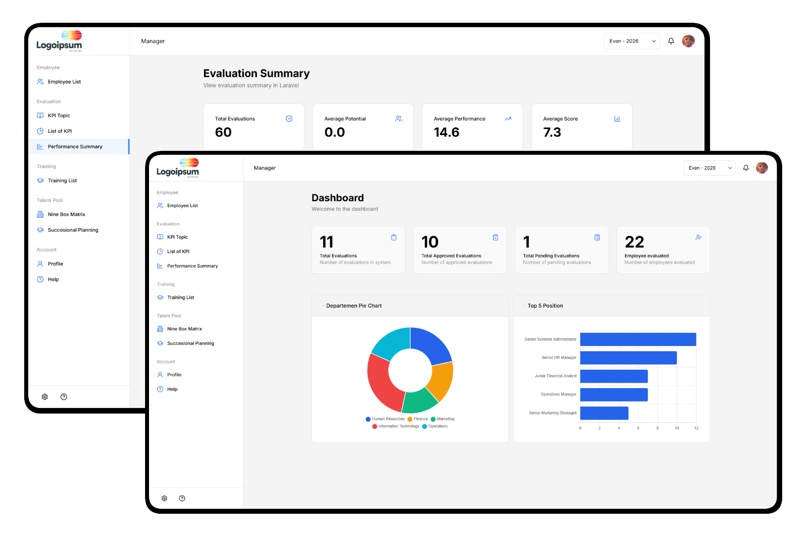

# Talent Management System

[](https://laravel.com)
[](https://php.net)
[](https://tailwindcss.com)
[](https://vitejs.dev)

A Laravel 12 application for managing employee evaluations, training programs, and succession planning. The system helps organizations track employee performance through KPI-based evaluations, manage training initiatives, and identify high-potential employees using the nine-box matrix framework for talent development and career planning.



## Features

### Core Modules

- **Employee Management** - Employee database with department and position tracking
- **Performance Evaluations** - KPI-based evaluation system with scoring and approval workflows
- **Training & Development** - Training program management with employee assignments
- **Talent Pool** - Nine-box matrix and succession planning
- **Feedback System** - Feedback collection and management
- **Dashboard Analytics** - Charts and metrics for performance insights

### Role-Based Access Control

| Role | Permissions |
|------|-------------|
| **System Administrator** | Full system access, user management, configuration |
| **People Development** | Training, evaluations, employee development |
| **Manager** | Team evaluations, training assignments, performance reviews |
| **Supervisor** | Employee oversight, evaluation participation |

### Key Capabilities

- Multi-period evaluations
- Excel export for reports and data (via Maatwebsite Excel)
- File attachments for training materials and documents
- Email notifications for assignments and updates
- Responsive UI built with Tailwind CSS and Alpine.js
- Interactive charts for department analytics and position rankings

## Tech Stack

- **Backend:** Laravel 12, PHP 8.2+
- **Frontend:** Blade Templates, Alpine.js, Tailwind CSS
- **Icons:** Lucide Icons
- **Database:** MySQL/PostgreSQL/SQLite
- **Dev Tools:** Vite, Laravel Breeze

## Prerequisites

- PHP 8.2 or higher
- Composer
- Node.js & npm/pnpm
- SQLite, MySQL, or PostgreSQL

## Installation

### 1. Clone the Repository

```bash
git clone https://github.com/yourusername/talent-management-system.git
cd talent-management-system
```

### 2. Install Dependencies

```bash
# Install PHP dependencies
composer install

# Install Node.js dependencies
pnpm install
# or npm install
```

### 3. Environment Configuration

```bash
# Copy environment file
cp .env.example .env

# Generate application key
php artisan key:generate
```

### 4. Database Setup

```bash
# Create database (for MySQL/PostgreSQL)
# Then run migrations
php artisan migrate
```

### 5. Build Assets

```bash
# Development
pnpm dev

# Production
pnpm build
```

### 6. Run the Application

```bash
# Start development server
php artisan serve
```

Visit `http://localhost:8000` in your browser.

## License

This project is open-sourced software licensed under the [GNU General Public License v3.0](LICENSE).

## Support

For support, please open an issue in the repository or contact the development team.

---

Built with Laravel
